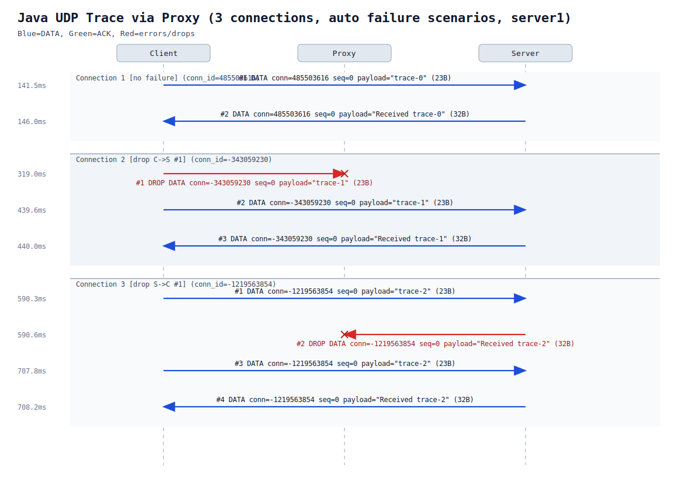

# DepChain (Dependable Chain) - Stage 1

This repository contains the Stage 1 foundation for the Highly Dependable Systems project, focused on the consensus layer of a permissioned blockchain.

## 1. Project Scope and Goals

The goal is to build a permissioned (closed membership), highly dependable blockchain system called **DepChain**.

Stage 1 focuses on:

- consensus using **Basic HotStuff** (Algorithm 2 from the reference paper);
- client to blockchain request/response integration;
- append-only in-memory storage for committed values.

Implementing **Chained HotStuff** (Section 5 of the paper) is optional and can be treated as an extra challenge.

## 2. System Assumptions

- **Static membership**: blockchain members and leader set are fixed before startup.
- **PKI available at startup**: public/private keys are generated and distributed before execution.
- **Threat model**: the local client library is trusted by the application, but a subset of blockchain members may be Byzantine.

## 3. System Architecture

The system is split into:

1. **Blockchain members (replicas/servers)**: maintain state and run HotStuff consensus.
2. **Client library**: embedded in the client application and maps app operations to blockchain requests.

Required interaction:

- client sends `<append, string>`;
- system returns whether/when the request was executed;
- when consensus reaches `DECIDE`, an upcall notifies the upper layer.

The Stage 1 blockchain state is an append-only array/list of strings in memory.

## 4. Networking and Communication Constraints

- Base network behavior is unreliable (loss, delay, duplication, corruption).
- Communication must use **UDP** as transport baseline.
- Secure channels such as TLS are not allowed for this stage.
- Reliability/authentication abstractions should be built on top of UDP (for example, Authenticated Perfect Links).

Networking layering roadmap:

```text
             /\
            /  \
           / App\               Client + consensus logic (to implement)
          /------\
         /   APL  \             Authenticated Perfect Links (to implement)
        /----------\
       /     PL     \           Perfect Links semantics (to implement)
      /--------------\
     /       SL       \         Stubborn Links (already implemented)
    /------------------\
   /      FairLoss      \       FairLossLink over UDP (already implemented)
  /----------------------\
 /      UDP Datagram      \     Unreliable network baseline
/__________________________\
```

Interpretation:

- Current UDP stack in code: `FairLossLink` + `StubbornLink` in `src/shared/.../network/links/`.
- `StubbornLink` provides tracked retries with exponential backoff + jitter and retry-heap compaction.
- Next layers to implement are authenticated and perfect-link semantics on top of this stack.

## 5. Technical Stack

- Language: **Java**.
- Crypto: Java Crypto API.
- Threshold signatures: `weavechain/threshold-sig` is suggested (alternatives are acceptable).
- Design: modular layered abstractions, evaluated for correctness and practical efficiency.

## 6. Repository Status and Layout

Current status:

- project structure builds with Java 21 and Gradle;
- membership, client, timeout, stubborn-link, and network settings are centralized in `config/config.yaml`;
- key directory structure exists in `config/keys/` (key files are not currently versioned);
- universal `Dpch` envelope + serialization is implemented;
- `FairLossLink` and `StubbornLink` are implemented and used by client/server mains;
- strict configuration parsing/validation and automated tests are in place;
- Basic HotStuff consensus and append-only blockchain state machine are still pending.

Project layout:

```text
.
|-- build.gradle
|-- settings.gradle
|-- README.md
|-- scripts/
|   `-- udp_pingpong_trace.py
|-- docs/
|   |-- hot-stuff-paper.pdf
|   `-- project.pdf
|-- config/
|   |-- config.yaml
|   `-- keys/
`-- src/
    |-- client/pt/ulisboa/depchain/client/Main.java
    |-- server/pt/ulisboa/depchain/server/Main.java
    |-- shared/pt/ulisboa/depchain/shared/
    |   |-- config/ConfigFile.java
    |   |-- network/
    |   |   |-- dpch/
    |   |   |   |-- Dpch.java
    |   |   |   |-- DpchSerialization.java
    |   |   |   `-- DpchType.java
    |   |   |-- links/
    |   |   |   |-- fairloss/FairLossLink.java
    |   |   |   `-- stubborn/
    |   |   |       |-- Event.java
    |   |   |       |-- ScheduledRetry.java
    |   |   |       |-- StubbornLink.java
    |   |   |       `-- TrackedMessage.java
    |   |   `-- messages/InboundMessage.java
    |   `-- utils/
    |       |-- BinarySerialization.java
    |       `-- ValidationUtils.java
    `-- test/java/pt/ulisboa/depchain/
        |-- integration/ReplicaConnectivityTest.java
        `-- shared/
            |-- config/ConfigFileTest.java
            |-- links/fairloss/
            |   |-- DpchSerializationTest.java
            |   `-- FairLossLinkTest.java
            |-- messages/InboundMessageTest.java
            `-- utils/BinarySerializationTest.java
```

What each file does:

- `build.gradle`: Gradle setup (plugins, Java 21 toolchain, source sets, test tasks, and run defaults).
- `settings.gradle`: Defines the Gradle root project name (`depchain`).
- `config/config.yaml`: Static system configuration:
  - system parameters (`n`, `f`, leader election, base view);
  - replica endpoints (consensus/client ports and key paths);
  - client settings (host, known replicas, request timeout);
  - stubborn-link retry parameters (`baseDelayMs`, `maxDelayMs`, `jitterRatio`, `maxPending`, `heapCompactMinSize`);
  - network limits (max packet size).
- `config/keys/`: Key material directory structure (files are expected at runtime, but not versioned here).
- `scripts/udp_pingpong_trace.py`: Runs client/server through a UDP proxy and generates a packet-level SVG trace with automatic per-connection failure scenarios.

- `src/client/pt/ulisboa/depchain/client/Main.java`: CLI client entrypoint. Loads config, sends a tracked request through `StubbornLink`, waits for matching response, then cancels retries.
- `src/server/pt/ulisboa/depchain/server/Main.java`: Replica entrypoint. Binds `StubbornLink` on `clientPort`, receives requests in a loop, and dispatches handlers on virtual threads.

- `src/shared/pt/ulisboa/depchain/shared/config/ConfigFile.java`: Strict parser/validator for `config/config.yaml` with consistency checks (IDs, ports, thresholds, stubborn limits, packet size). Supports YAML comments with `#`.

- `src/shared/pt/ulisboa/depchain/shared/network/links/fairloss/FairLossLink.java`: Low-level UDP fair-loss transport over `DatagramSocket` with thread-safe send/receive paths.
- `src/shared/pt/ulisboa/depchain/shared/network/links/stubborn/StubbornLink.java`: Retry-capable link with tracked send/cancel/force-resend, exponential backoff + jitter, and retry-heap compaction.
- `src/shared/pt/ulisboa/depchain/shared/network/links/stubborn/TrackedMessage.java`: Tracked message state and identity key used by `StubbornLink`.
- `src/shared/pt/ulisboa/depchain/shared/network/links/stubborn/ScheduledRetry.java`: Retry scheduling item (`endpoint`, `key`, `dueAtMs`) used in the retry heap.
- `src/shared/pt/ulisboa/depchain/shared/network/links/stubborn/Event.java`: Sealed event model for the stubborn event loop (`SendTracked`, `CancelTracked`, `ForceResend`, `Shutdown`).
- `src/shared/pt/ulisboa/depchain/shared/network/dpch/DpchSerialization.java`: Binary framing/unframing for the universal DPCH wire format (`magic`, `version`, `conn_id`, `type`, `seq_num`, `payload_len`, `payload`).
- `src/shared/pt/ulisboa/depchain/shared/network/messages/InboundMessage.java`: Immutable envelope for one inbound DPCH packet plus sender endpoint metadata (`senderIp`, `senderPort`).
- `src/shared/pt/ulisboa/depchain/shared/utils/BinarySerialization.java`: Reusable binary read/write helpers for primitive types, UUID, strings, and byte arrays.

- `src/test/java/pt/ulisboa/depchain/shared/config/ConfigFileTest.java`: Unit tests for config parsing/validation.
- `src/test/java/pt/ulisboa/depchain/shared/links/fairloss/DpchSerializationTest.java`: Unit tests for packet codec round-trip, malformed headers, invalid slices, and payload boundary checks.
- `src/test/java/pt/ulisboa/depchain/shared/utils/BinarySerializationTest.java`: Unit tests for primitive/structured binary field IO and invalid length checks.
- `src/test/java/pt/ulisboa/depchain/shared/links/fairloss/FairLossLinkTest.java`: Unit tests for fair-loss send/receive behavior, malformed packet handling, and concurrent multi-client scenarios.
- `src/test/java/pt/ulisboa/depchain/shared/messages/InboundMessageTest.java`: Unit tests for `InboundMessage` field preservation and constructor validation.
- `src/test/java/pt/ulisboa/depchain/integration/ReplicaConnectivityTest.java`: Integration test that boots replicas as processes and verifies client connectivity to all of them.

## 7. Universal DPCH Communication Packet

All network communication uses the same envelope: `Dpch`.

- `request`, `response`, `ack`, `nack`, `syn`, `fin`, and other future control messages share the same binary structure.
- `FairLossLink` only sends/receives this envelope; higher layers decide payload meaning.
- Supported types are centralized in `DpchType`.

Wire format:

```text
DPCH Frame
| magic(4) | version(1) | conn_id(4) | type(1) | seq_num(4) | payload_len(2) | payload(N) |
```

Field details:

- `magic` (`4 bytes`): ASCII signature `DPCH` for protocol identification.
- `version` (`1 byte`): frame format version.
- `conn_id` (`4 bytes`): logical session/request flow identifier.
- `type` (`1 byte`): semantic class of message (`0=DATA`, `1=ACK`, `2=NACK`, `3=SYN`, `4=FIN`).
- `seq_num` (`4 bytes`): sequence number inside the connection flow.
- `payload_len` (`2 bytes`, uint16): payload size.
- `payload` (`N bytes`): application/protocol-specific data.

Practical use today:

- Client request: currently encoded as `Dpch.data(...)`.
- Server response: currently encoded as `Dpch.data(...)`.
- Client/server payload content is currently plain UTF-8 text (no nested status envelope).
- Current request path uses `StubbornLink.sendTracked(...)` on client and `cancelTracked(...)` when the response is received.
- `FairLossLink` remains a best-effort UDP primitive (no retries/deduplication) and is wrapped by `StubbornLink`.
- ACK/NACK/SYN/FIN: already supported at the envelope level via `Dpch.ack(...)`, `Dpch.nack(...)`, `Dpch.syn(...)`, `Dpch.fin(...)` (not used yet in the current client/server flow; reserved for future perfect-link logic).

## 8. Prerequisites

- Java 21
- Gradle (optional if using the included wrapper)

This repository includes Gradle wrapper scripts (`gradlew` / `gradlew.bat`).

Gradle source roots are configured as:

- `src/server`
- `src/client`
- `src/shared`
- `src/test/java`

## 9. Local Setup, Build, and Test

Check Java:

```powershell
java -version
```

Build and test:

```powershell
.\gradlew.bat clean build
.\gradlew.bat test
.\gradlew.bat integrationTest
```

Run one replica locally (defaults to `server1` and `config/config.yaml`):

```powershell
.\gradlew.bat run
```

Run a specific replica/config:

```powershell
.\gradlew.bat run -PreplicaId=server2 -PconfigPath=config/config.yaml
```

## 10. Membership Configuration

`config/config.yaml` currently defines:

- `n = 4` replicas, `f = 1`;
- localhost addresses and per-replica consensus/client ports;
- client identity, host, request timeout, and known replica IDs (no dedicated client port);
- timeout values for view changes and retransmissions;
- stubborn retry parameters and network max packet size.

Before execution, ensure:

- key files exist at the configured paths;
- required ports are free;
- all replicas use the same membership/network/stubborn configuration.

## 11. Stubborn Ping-Pong Diagram

The current stubborn-link ping-pong flow is documented here:



What this diagram reflects as already implemented:

- client request over `StubbornLink.sendTracked(...)`;
- server reply over shared UDP socket (`sendOnce(...)`);
- client-side retry cancellation via `cancelTracked(...)` on matching response;
- retry scheduling with exponential backoff + jitter;
- retry-heap compaction strategy for stale scheduled entries.

## 12. Recommended Implementation Roadmap

1. Implement shared models and serialization in `src/shared`.
2. Implement UDP networking plus authenticated/reliable link abstraction in `src/server`.
3. Implement Basic HotStuff happy path (`prepare -> pre-commit -> commit -> decide`).
4. Add crash-fault handling (timeouts and view change).
5. Add Byzantine protections (signature checks, QC validation, equivocation detection).
6. Implement client library flow and append service integration.
7. Add intrusive tests in `src/test/java`.

## 13. Testing and Validation Requirements

Black-box tests are not enough. Test infrastructure should support fault injection, including:

- message loss/delay/duplication/manipulation;
- malicious or faulty leader behavior;
- invalid signatures and forged messages;
- conflicting proposals in the same view.

## 14. Submission and Evaluation (From the Project Brief)

- Deadline: **March 10 at 23:59** via Fenix.
- Team ethics: work must be original to the group.
- Required deliverables:
  - ZIP with source code, dependencies, demos, and attack/byzantine simulations;
  - README with explicit reproduction steps for tests and demos;
  - Report (max 5 pages, Springer LNCS format) with:
    - design decisions and justification;
    - threat analysis;
    - protection mechanisms;
    - dependability guarantees.

## References

1. HotStuff paper: <https://arxiv.org/pdf/1803.05069>
2. Springer LNCS guidelines: <https://www.springer.com/gp/computer-science/lncs/conference-proceedings-guidelines>
3. Threshold signatures (optional): <https://github.com/weavechain/threshold-sig>

