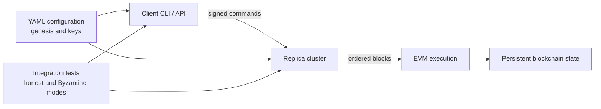
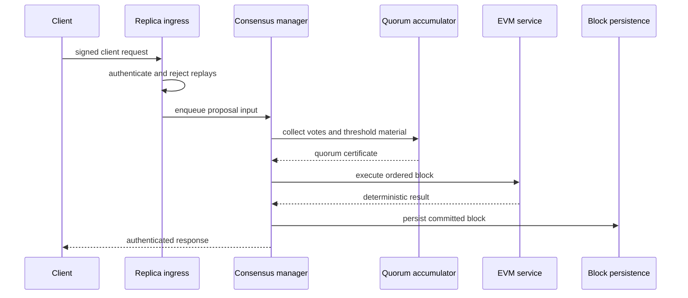
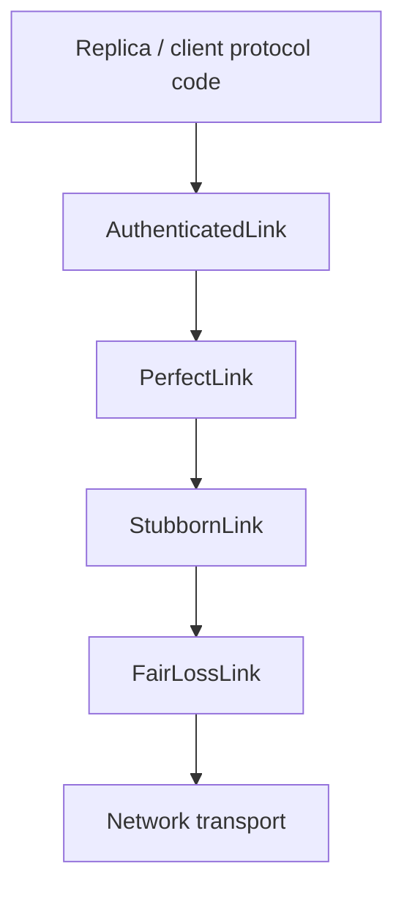
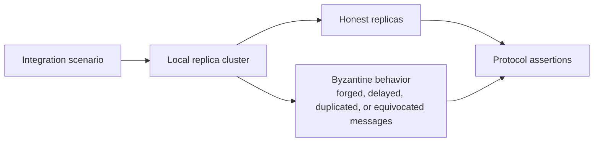

# DepChain Architecture

This document describes the maintained implementation boundaries for the
permissioned Byzantine fault-tolerant blockchain prototype.

## System Context

Clients and replicas are configured from the same cluster and genesis material.
The implementation is intended for local experiments and integration testing,
not production key management or open-network deployment.

## Request Path

The consensus path owns ordering. Execution is deterministic after a block is
ordered, and persistence records committed blocks so recovery behavior can be
tested independently from the networking layer.

## Network Stack

The lower layers model progressively stronger communication semantics. Protocol
logic depends on the authenticated boundary instead of directly trusting raw
transport messages.

## Component Responsibilities

| Component | Responsibility | Boundary |
| --- | --- | --- |
| `client` | Builds signed commands and validates responses | Does not order requests |
| `server/consensus` | Leader flow, votes, quorum certificates, and threshold exchange | Does not implement EVM semantics |
| `shared/network` | Fair-loss, stubborn, perfect, and authenticated links | Does not decide protocol validity |
| `server/execution` | Solidity contract loading and EVM execution | Assumes ordered input |
| `server/node` | Replica lifecycle, genesis materialization, and block storage | Owns startup and recovery concerns |
| `shared/config` | Cluster, key, and genesis validation | Rejects invalid deployment assumptions early |

## Adversarial Test Harness

The tests exercise failure modes such as invalid quorum certificates,
equivocation, forged responses, duplicated traffic, replayed requests, and
persistence recovery. These scenarios define the repository's current quality
bar more accurately than production deployment guarantees.

## Architectural Constraints

- The implementation targets a fixed, configured permissioned cluster.
- Membership changes, operational key rotation, and production monitoring are
  outside the maintained boundary.
- Byzantine behavior is represented through local integration scenarios rather
  than a hostile public network.
- EVM execution is kept behind the ordered-block boundary; consensus does not
  inspect contract internals.
